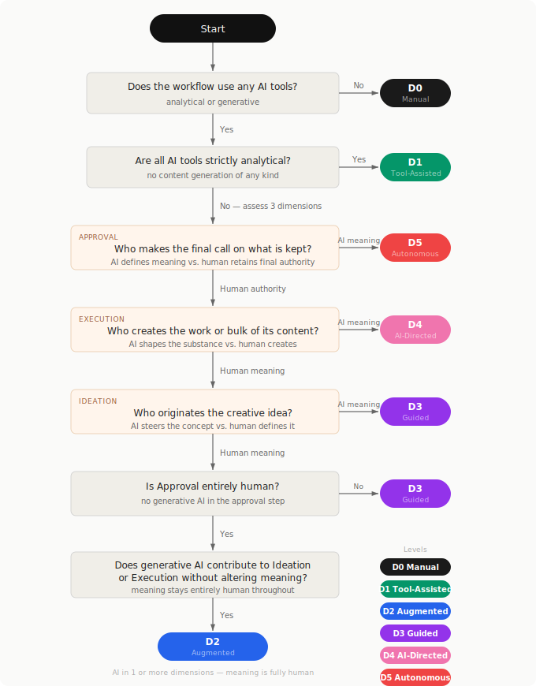

# DALIA Core Specification (v1.0)

The DALIA scale measures AI intervention based on cognitive load, intention, and control across the three phases of the creative design process: Ideation, Execution, and Refinement.

## 6 Levels of DALIA

| DALIA Level | Category Name | Summary | Who finds the idea? | Who creates it? | Who curates & finishes  it? | Real life examples |
| --- | --- | --- | --- | --- | --- | --- |
| D0 | Manual (No AI) | 100% Human. AI is not used at all. The creative process is performed entirely manually. | Human | Human | Human | Painting on a real canvas; writing an essay from scratch; taking a film photograph. |
| D1 | Tool-Assisted | Human. AI analyses in the background. Human acts and decides. | Human | Human | Human (with analytical AI tools) | Facial recognition groups photos in an album; tempo/key detection in audio software; code linter flags errors without rewriting. |
| D2 | AI-Augmented | Human. AI intervenes in the creation of specific, small elements but doesn't change the meaning of the work. | Human + limited inputs from AI | Mostly Human (Generative AI fills small gaps) | Human | Using generative fill to remove a small imperfection from an image; asking AI to rephrase one clunky sentence. |
| D3 | Guided Creation | Human & AI Teamwork. The human and AI act as creative partners. | Human + creative inputs from AI | Human & AI (AI builds a base, human changes it heavily) | Human (does major edits and assembly changing the meaning of the AI input) | Human-made art based on generated material; co-writing a story line-by-line with a chatbot. |
| D4 | AI-Generated (Human Directed) | Human as Art Director. The AI does the creative and production work, while the human gives orders and judges the results. | AI under Human direction | AI (creates the bulk of the work) | Human (picks the best option or makes tiny adjustments) | Using a generated image as-is; having an AI write a full blog post and only changing a few words; vibe coding without human code interventions. |
| D5 | Fully Autonomous | 100% AI. The human just presses "start" or sets up a system. The AI systems operate independently to handle the task. | AI | AI | None (used exactly as the AI made it) | A news bot that automatically writes and posts updates on social media; an AI generating endless background music on its own. |

> _Note: We will expand this document through community RFCs to include specific criteria for visual arts, music production, software engineering, and literature._

## Notes
1. The scale reflects a shift in AI's role: at lower levels (D0-D1), AI operates analytically, helping humans perceive and decide. From D2 upward, AI becomes generative, producing content that the human then shapes or accepts.
2. DALIA classifies the production workflow, not upstream preparation. Custom model training, dataset curation, or fine-tuning are not factored into the level. A practitioner who trains a LoRA for weeks then generates in one click is rated on the generation act itself. This specific scenario may be adressed in future revisions. 
3. When a project combines multiple DALIA levels across its components, the overall classification defaults to the highest level present. A feature film shot on analog cameras but incorporating AI-generated visual effects is classified at the level of those effects, not the live footage. Where granularity matters, an optional compound notation may specify per-component levels (e.g. D2, with D4 elements for visual effects). The default rule remains the maximum.
4. DALIA does not evaluate the ethics of the AI tools used. Some models are built with more ethical approaches than others (training data consent, environmental impact, labour practices), and these considerations matter. However, they fall outside the current scope of the scale. DALIA measures the degree of AI involvement in the creative process, not the nature or provenance of the AI itself. Future versions may explore ways to integrate ethical dimensions as a complementary axis.

## Classification Procedure
To systematically determine the DALIA level of a work, follow the steps below in order. The procedure evaluates the creative workflow across three dimensions — **Ideation**, **Execution**, and **Approval** — and applies a priority rule set to derive a single level.

> _Note: This workflow is designed to serve as the basis for a form used to determine the DALIA level of a project. However, it can be used to clarify any scenario._

### Step 0 — Preliminary: does the workflow involve any AI tools?

| Answer | Outcome |
| --- | --- |
| No AI tools of any kind were used. | **D0** — stop here. |
| AI tools were used, but exclusively for analytical tasks (detection, analysis, flagging) with no content generation. | **D1** — stop here. |
| At least one generative AI tool was used (text, image, audio, code, or other content generation). | Proceed to Step 1. |

> _The D0/D1 boundary rests on whether any generative AI was involved at all. Analytical AI (linters, classifiers, detectors) that operates without producing new content does not cross this threshold._

---

### Step 1 — Assess the three dimensions

For each dimension, select the option that best describes the workflow:

| Dimension | Question | Options |
| --- | --- | --- |
| **Ideation** | Who finds or originates the creative idea? | (H) Human only · (H+AI, human meaning) AI contributes but its contribution does not alter the meaning — the meaning is determined by the human · (H+AI, AI meaning) AI contributes and defines the direction or concept · (AI) AI alone |
| **Execution** | Who creates the work or the bulk of its content? | (H) Human only · (H+AI, human meaning) AI contributes but its contribution does not alter the meaning — the meaning is determined by the human · (H+AI, AI meaning) AI contributes and its output shapes the substance of the work · (AI) AI alone |
| **Approval** | Who makes the final call on what is kept? | (H) Human only — approval is entirely human · (H+AI, human meaning) AI assists the evaluation process but the human makes the final judgment · (H+AI, AI meaning) AI determines what is accepted or rejected · (AI) AI alone |

> _"The contribution does not alter the meaning" refers to cases where AI fills a gap, corrects a technical defect, or rephrases without changing intent — and where the human would recognise the result as expressing exactly what they meant. As soon as AI steers the direction, introduces a concept, or shapes what the work says, meaning has shifted._

---

### Step 2 — Apply the decision rules

Apply these rules in priority order, stopping at the first match:

| Priority | Condition | Level |
| --- | --- | --- |
| 1 | Approval = AI alone **or** H+AI with AI meaning | **D5** |
| 2 | Execution = AI alone **or** H+AI with AI meaning, and Approval is human-controlled | **D4** |
| 3 | Ideation = AI alone **or** H+AI with AI meaning, and Execution and Approval are both human-controlled | **D3** |
| 4 | Approval is entirely human (H only), and Ideation and/or Execution involve H+AI with human meaning | **D2** |
| 4a | &nbsp;&nbsp;&nbsp;→ AI's contribution does not alter the meaning in any dimension. The meaning is determined by the human throughout. | **D2** |
| 5 | No generative AI is involved in any dimension | **D0** (confirmed) |

> _Note: H+AI with human meaning in Approval alone (without generative AI in Ideation or Execution) is classified as D3, not D2. Approval is the final act of creative authority; any generative AI involvement in that act — even under human semantic control — signals a deeper level of collaboration than augmentation._

> _The interactive decision tree covering all 64 combinations is available as a [reference tool](assets/classification-tree.html)._

---

### Visual overview

---

### Classification examples

| Scenario | Ideation | Execution | Approval | Level |
| --- | --- | --- | --- | --- |
| Essay written entirely by hand | H | H | H | D0 |
| Photo edited with AI to remove a cable from the sky | H | H+AI, human meaning | H | D2 |
| Story written by human, AI rephrases one clunky sentence | H | H+AI, human meaning | H | D2 |
| Both idea and draft touched by AI, human retains full meaning | H+AI, human meaning | H+AI, human meaning | H | D2 |
| Blog post outlined by human, drafted by AI, edited heavily | H | H+AI, AI meaning | H | D3 |
| Human art based on AI-generated visual material | H+AI, human meaning | H+AI, AI meaning | H | D3 |
| AI writes a full blog post, human changes a few words | H | AI | H | D4 |
| Generated image used as-is | H+AI, AI meaning | AI | H | D4 |
| AI writes and posts content automatically | AI | AI | AI | D5 |

## References
**1. Haase, J., & Pokutta, S. (2024). _Human-AI Co-Creativity: Exploring Synergies Across Levels of Creative Collaboration_.** _Contribution to DALIA:_ This research introduced a four-level taxonomy of human-AI interaction, ranging from a "Digital Pen" to an "AI Co-Creator". It fundamentally inspired the progression of agency within the DALIA scale, demonstrating how AI evolves from a passive execution tool into an active, synergistic partner in the creative process.

**2. Wu, Z., et al. (2021). _AI Creativity and the Human-AI Co-creation Model_.** _Contribution to DALIA:_ By dividing the Human-AI co-creative design process into distinct, iterative stages (including perception, expression, construction, and testing), this work provides the theoretical foundation for evaluating AI's intervention not as a whole, but across the separate dynamics of Ideation, Execution, and Refinement.

**3. Hutson, J. (2025). _Human-AI Collaboration in Writing: A Multidimensional Framework for Creative and Intellectual Authorship_.** _Contribution to DALIA:_ This paper explicitly addresses the limitations of evaluating AI involvement on a simple sliding scale from "none" to "complete" `. It validates DALIA's shift away from a flawed percentage-based metric toward a multidimensional matrix assessing content generation, structural assistance, and creative input `.

**4. Lamers, M.H. (2025). _Introducing a scale for AI's artistic autonomy_.** _Contribution to DALIA:_ This research proposes a specific taxonomy for levels of automated artistic autonomy based on the division of responsibilities. It confirms the necessity for an operational scale that clarifies the autonomy given to generative AI systems and who is ultimately responsible for the steps within an artistic scenario.

**5. Salma, Z., et al. (2025). _Designing Co-Creative Systems: Five Paradoxes in Human–AI Collaboration_.** _Contribution to DALIA:_ By analyzing the irreducible paradoxes of co-creation (such as the tension between human control and machine serendipity), this framework justifies the necessity of identifying the "Locus of Control" (e.g., human as a director or curator) to understand how creative agency is maintained when using generative tools.

**6. SAE International (2021). _Taxonomy and Definitions for Terms Related to Driving Automation Systems (SAE J3016)_.** _Contribution to DALIA:_ Although originating from the automotive industry, this internationally recognized standard establishes the definitive 6-level architecture (Levels 0 to 5) for measuring the transfer of tasks from human to machine \`\`. It provides the structural benchmark and logical progression used to build the DALIA levels.
